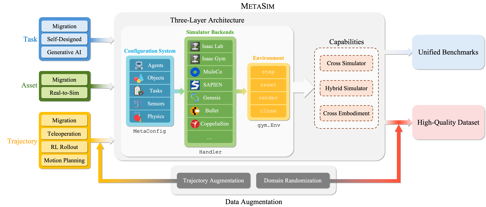

# RoboVerse


<p align="center">
  <a href="https://roboverseorg.github.io"></a>
  <a href="https://arxiv.org/abs/2504.18904"></a>
  <a href="https://roboverse.wiki"></a>
  <a href="https://github.com/RoboVerseOrg/RoboVerse/issues"></a>
  <a href="https://github.com/RoboVerseOrg/RoboVerse/discussions"></a>
  <a href="https://discord.gg/6e2CPVnAD3"></a>
  <a href="docs/source/_static/wechat.jpg"></a>
</p>

## Interactive System Diagram
<p align="center">
  
  <map name="metasim-map">
    <area shape="rect"
          coords="2836,492,3309,632"
          href="metasim/user_guide/cross_sim.html"
          alt="Cross-Sim Guide"
          style="cursor: pointer;" />
    <area shape="rect"
        coords="2830,929,3313,1081"
        href="metasim/user_guide/cross_embodiment.html"
        alt="Cross Embodiment"
        style="cursor: pointer;" />
    <area shape="rect"
        coords="771,876,367,773"
        href="metasim/user_guide/real2sim.html"
        alt="Real2Sim"
        style="cursor: pointer;" />
    <area shape="rect"
        coords="780,1241,365,1139"
        href="metasim/user_guide/teleoperate_demo.html"
        alt="Real2Sim"
        style="cursor: pointer;" />
  </map>
</p>

<script src="https://cdn.jsdelivr.net/npm/image-map-resizer@1.0.10/js/imageMapResizer.min.js"></script>
<script>
  window.onload = function () {
    imageMapResize();
  };
</script>


## Acknowledgement
If you find this work useful in your research, please consider citing:

```bibtex
@misc{geng2025roboverse,
    title={RoboVerse: Towards a Unified Platform, Dataset and Benchmark for Scalable and Generalizable Robot Learning},
    author={Haoran Geng and Feishi Wang and Songlin Wei and Yuyang Li and Bangjun Wang and Boshi An and Charlie Tianyue Cheng and Haozhe Lou and Peihao Li and Yen-Jen Wang and Yutong Liang and Dylan Goetting and Chaoyi Xu and Haozhe Chen and Yuxi Qian and Yiran Geng and Jiageng Mao and Weikang Wan and Mingtong Zhang and Jiangran Lyu and Siheng Zhao and Jiazhao Zhang and Jialiang Zhang and Chengyang Zhao and Haoran Lu and Yufei Ding and Ran Gong and Yuran Wang and Yuxuan Kuang and Ruihai Wu and Baoxiong Jia and Carlo Sferrazza and Hao Dong and Siyuan Huang and Yue Wang and Jitendra Malik and Pieter Abbeel},
    primaryClass={cs.RO},
    month={April},
    year={2025},
    url={https://github.com/RoboVerseOrg/RoboVerse},
}
```

<!-- ## Table of Contents -->
```{toctree}
:hidden:
:titlesonly:

metasim/index
dataset_benchmark/index
roboverse_learn/index
API/index
FAQ/index
```
