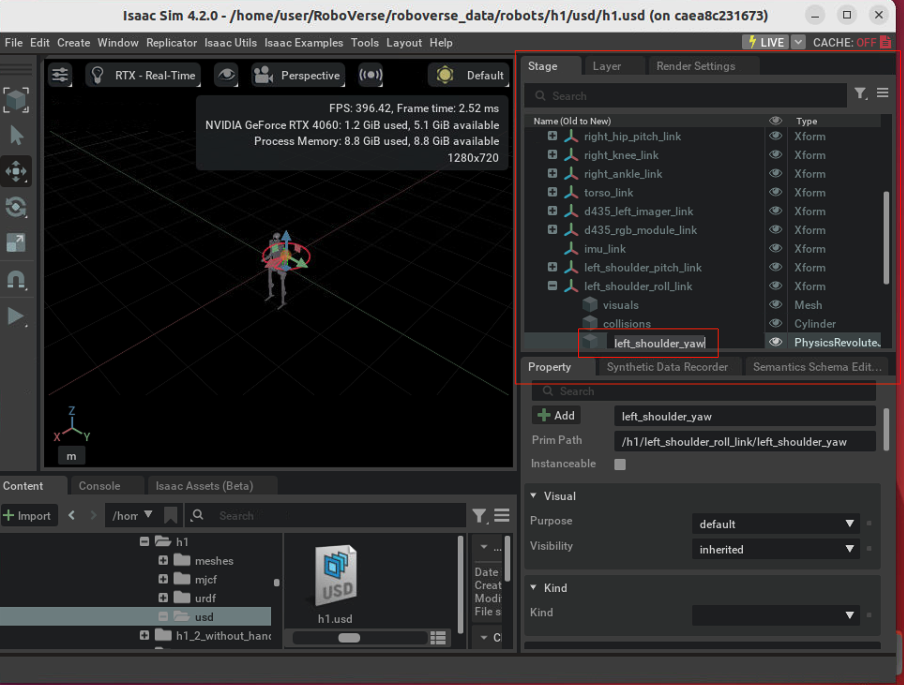

# Adding New Robots


## 1. Create a Robot Configuration File
Define a new robot in `metasim/cfg/robots/{robot_name}_cfg.py`.

The definition of each term is explained in [API Documentation](https://roboverse.wiki/metasim/api/metasim/metasim.cfg.robots#baserobotcfg).

The following terms are mandatory:
- ``num_joints``
- ``actuators``
- ``joint_limits``

The following terms should have at least one of the following, depending on the simulator you want to use:
- ``usd_path``
- ``urdf_path``
- ``mjcf_path``
- ``mjx_mjcf_path``

The following terms are needed if you want to use end-effector control:
- ``ee_body_name``
- ``gripper_open_q``
- ``gripper_close_q``
- ``curobo_ref_cfg_name``
- ``curobo_tcp_rel_pos``
- ``curobo_tcp_rel_rot``

A good example is [franka_cfg.py](https://github.com/RoboVerseOrg/RoboVerse/blob/main/metasim/cfg/robots/franka_cfg.py) and [h1_cfg.py](https://github.com/RoboVerseOrg/RoboVerse/blob/main/metasim/cfg/robots/h1_cfg.py), which are both well-tested.

Also, please import the robot configuration class in `metasim/cfg/robots/__init__.py`. Please make sure the robot class name is in [camel case](https://en.wikipedia.org/wiki/Camel_case) (e.g. `FrankaPandaCfg`).

## 2. Test the Reliability
Run the following command to test the reliability of the robot:

```bash
python metasim/scripts/random_action.py --sim=${your_simulator} --robot=${robot_name}
```

Please make sure the robot_name is same as above. Either in camel case (e.g. `--robot=FrankaPanda`) or snake case (e.g. `--robot=franka_panda`).

If your robot doesn't break apart and no error occurs during the test, it should be good to use!

## 3. Add the Robot to the RoboVerse Data Repository

Add the robot to the [RoboVerse data repository](https://huggingface.co/datasets/RoboVerseOrg/roboverse_data) by a creating a PR. Please follow the [data structure](https://roboverse.wiki/metasim/developer_guide/data_structure). We thank you for your contribution!

## Tips

### 1. Source of the Robot URDF/MJCF/USD
- For USD, [Isaac Sim Assets](https://docs.isaacsim.omniverse.nvidia.com/latest/assets/usd_assets_robots.html) provides good examples.
- For MJCF, [mujoco_menagerie](https://github.com/google-deepmind/mujoco_menagerie) is a reliable source.

### 2. Joint Names
USD/URDF/MJCF usually define joint names in different ways. If you have multiple formats of a robot and you want to use the cross-simulation feature, please make sure the joint names are consistent.
- To change the joint names in URDF/MJCF, directly edit the URDF/MJCF file with text editor.
- The change the joint names in USD, you need to open it in Isaac Sim (Isaac Lab) GUI, find the joint item in USD tree, and change the name by double-clicking the name.


