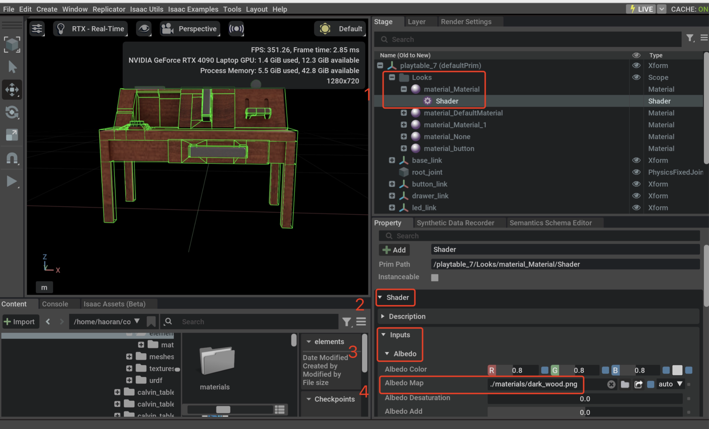

# Migrating New Tasks
## Preparing assets
### Converting assets
You need to convert the assets into usd files and put them under `./data_isaaclab/assets/<benchmark_name>/<task_name>`.

Isaac Lab provides easy-to-use tools to convert urdf, mjcf, and mesh files into usd files, see [here](https://isaac-sim.github.io/IsaacLab/main/source/how-to/import_new_asset.html).

Specifically, if you are migrating from old version, please refer to `scripts/convert_usd.py` to ensure the new assets are compatible with the Isaac Lab standard.

### Assets textures

Please make sure all the paths of the Albedo Map (and other bitmap textures) are relative path.


Please refer to [Omniverse Materials Best Practices](https://docs.omniverse.nvidia.com/simready/latest/simready-asset-creation/material-best-practices.html) for more details.

### Test assets
You can use the following command to test the assets:
```bash
python scripts/test_usd.py --usd_path {your_usd_path}
```
By default, the usd will be loaded as Rigid Object.

For more usage, please run
```bash
python scripts/test_usd.py --help
```

Please make sure this script doesn't give any error.

If the scripts doesn't give any error, the assets look good, but still cannot be loaded in MetaSim framework, please report an issue.

## Implementing tasks
TODO

## Collecting trajectories
Prepare a .pkl file containing demonstration data. Use the following v2 data format:

### Data format v2
The file name should be ended with `_v2.pkl`. Once it is ended with `_v2.pkl`, the demo reader will automatically read it by v2 format.
The data format is:
```
{
    "franka": [  // robot name should be same as BaseRobotMetaCfg.name
        {
            "actions": [
                {
                    // one or more of the following
                    "dof_pos_target": {
                        "{joint_name1}": float,
                        "{joint_name2}": float,
                        ...
                    },
                    "ee_pose_target": {
                        "pos": [float, float, float],
                        "rot": [float, float, float, float],  // (w, x, y, z)
                        "gripper_joint_pos": float,
                    }
                },
                ...
            ],
            "init_state": {
                "{obj_name1}": {  // example rigid object
                    "pos": [float, float, float],
                    "rot": [float, float, float, float],  // (w, x, y, z)
                },
                "{obj_name2}": {  // example articulation object
                    "pos": [float, float, float],
                    "rot": [float, float, float, float],  // (w, x, y, z)
                    "dof_pos": {
                        "{joint_name1}": float,
                        "{joint_name2}": float,
                        ...
                    }
                },
                "{robot_name}": {  // robot name should be same as BaseRobotMetaCfg.name
                    "pos": [float, float, float],
                    "rot": [float, float, float, float],  // (w, x, y, z)
                    "dof_pos": {
                        "{joint_name1}": float,
                        "{joint_name2}": float,
                        ...
                    }
                },
                ...
            },
            "states": [state1, state2, ...]  // list of states, a state has the same format as the init_state
            "extra": None  // extra information for specific use, default is None
        },
        ...
    ],
    ...
}
```
Explaination:
- The relationship between actions and states:
    ```{mermaid}
    graph LR
    init_state --> a0["actions[0]"] --> s0["states[0]"] --> a1["actions[1]"] --> s1["states[1]"] --> ... --> an["actions[n-1]"] --> sn["states[n-1]"]
    ```
- `len(actions) == len(states)`
- Every object should have a key in the `init_state` and `states` dict.

### Data format v1 (deprecated)
The file name is typically `trajectory-unified.pkl`.
The data format is:
```python
{
    'source': 'ManiSkill2-rigid_body-PickSingleYCB-v0',
    'max_episode_len': 147,
    'demos': {
        "franka": [
            {
                'name': 'banana_traj_0',
                'description': 'Banana nana bana ba banana.', # optional
                'env_setup': {
                    "init_q": [...],          # [q_len], 9 for Franka
                    "init_robot_pos": [...],  # [3]
                    "init_robot_quat": [...], # [4]
                    "init_{obj_name}_pos": [...],    # [3]
                    "init_{obj_name}_quat": [...],   # [4]
                    "init_{joint_name}_q": [...],  # [1], for articulations
                    ...
                },
                'robot_traj': {
                    "q": [[...], ...],        # [demo_len x q_len]
                    "ee_act": [[...], ...],   # [demo_len x 1] 0.0~1.0 0 for close and 1 for open
                }
            },
            ...
        ],
    }
}
```
Explanation:
- `max_episode_len`: The maximum length of the demo in this file. This is used to pad the trajectories so they can be stacked into a tensor for efficiency.
- `robot_traj`:
    - `q`: Robot joint positions
    - `ee_act`: End-effector actions
- In each `env_setup`:
  - `init_q`: initial robot joint positions
  - `init_pos`: initial robot position
  - `init_quat`: initial robot rotation (quaterion)
  - The other `init_*` are used to initialize each environment, and what you save here could be retrived in the `_reset_idx` method of the task env. This usually includes the intial object position, rotation, scaling, joint positions, etc.


### Convert v1 to v2
If you have already exported the trajectory data in v1 format, you can convert it to v2 format by:
```bash
python scripts/convert_traj_v1_to_v2.py --task CloseBox --robot franka
```

### Examples
```{toctree}
:titlesonly:

from_robosuite
from_calvin
```

### Docstrings

Add your new tasks to `docs/source/metasim/api/metasim/metasim.cfg.tasks.rst` so that they can be indexed by the docs.
