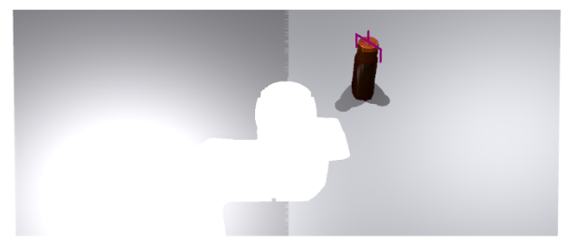

# 1. Object Grasping

We provide a simple tutorial to show you how to grasp an object based on GSNet.

First, you need to install [curobo](https://roboverse.wiki/metasim/get_started/advanced_installation/curobo) and [gsnet](https://roboverse.wiki/metasim/get_started/advanced_installation/gsnet). RoboVerse provides a clean readme to help you install the dependencies. Follow the link to install them!


Then run:
```bash
python get_started/motion_planning/1_object_grasping.py --sim <simulator>
```

## Inference GSNet
In this code, we will first use existing GSNet model to predict the grasp pose. Then we will use the predicted grasp pose to grasp the object.

After running the code, you will get the following image:

<div style="text-align: center;">
    
</div>
<br>

## Grasp the Object
We also provide a grasping planning code to grasp the object, based on the predicted grasp pose.

After running the code, you will get the following video:

<div style="text-align: center;">
    <video width="50%" autoplay loop muted playsinline>
        <source src="https://roboverse.wiki/_static/standard_output/motion_planning/1_object_grasping_isaacgym.mp4" type="video/mp4">
    </video>
</div>
<br>
