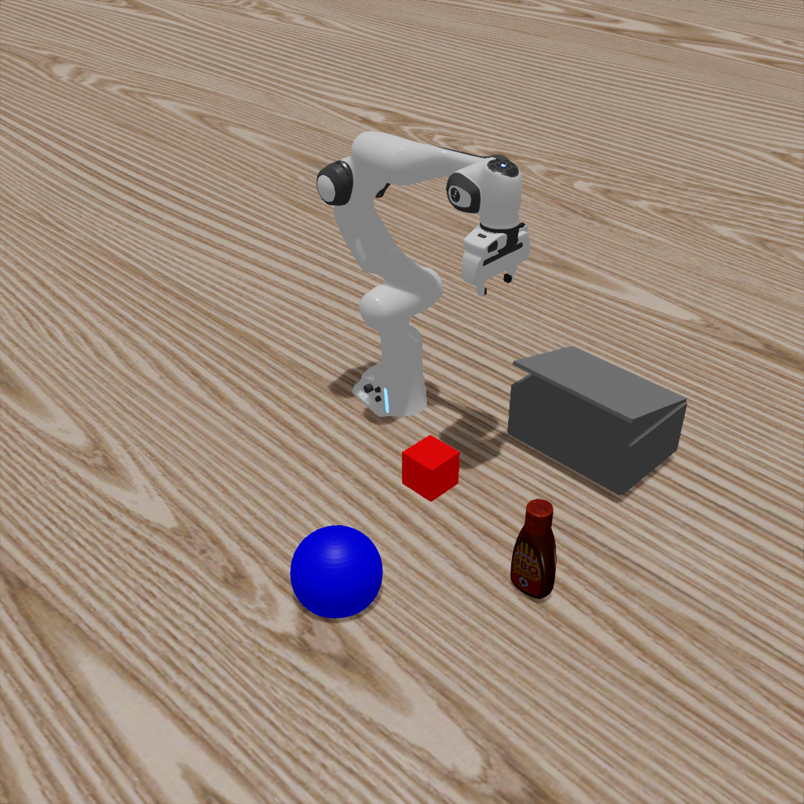
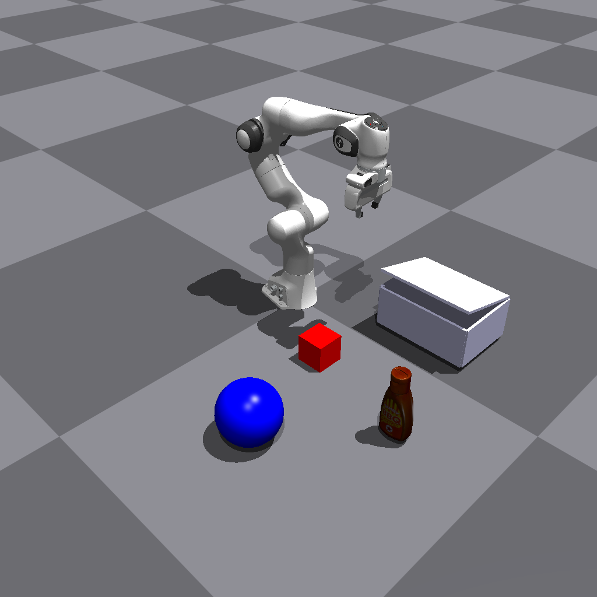
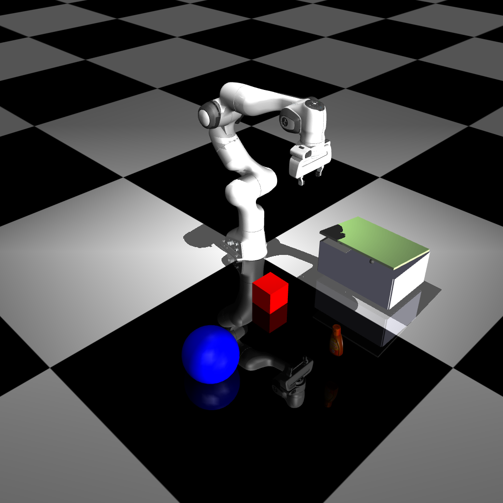
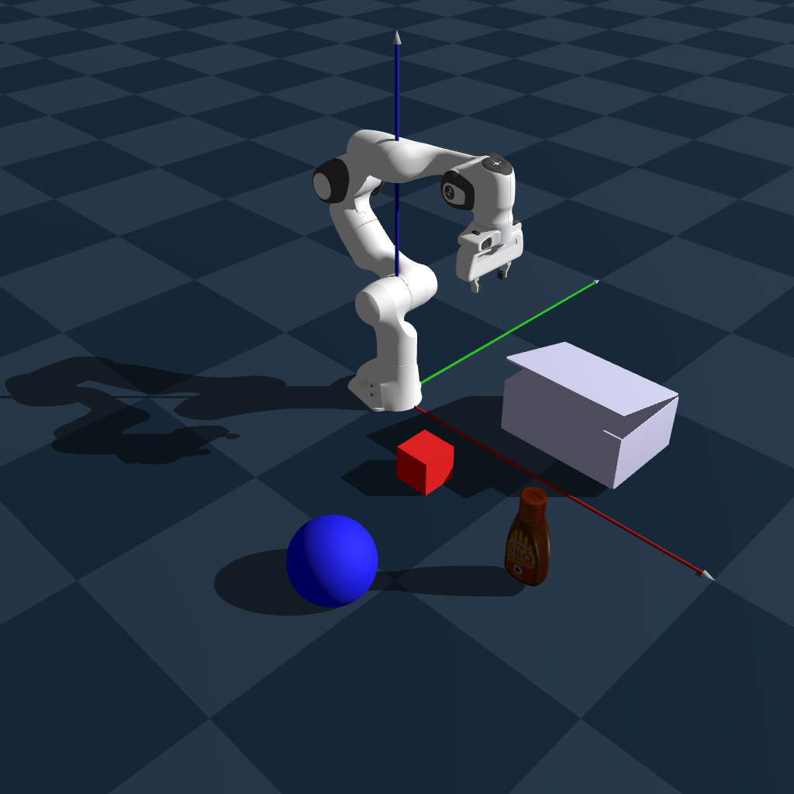
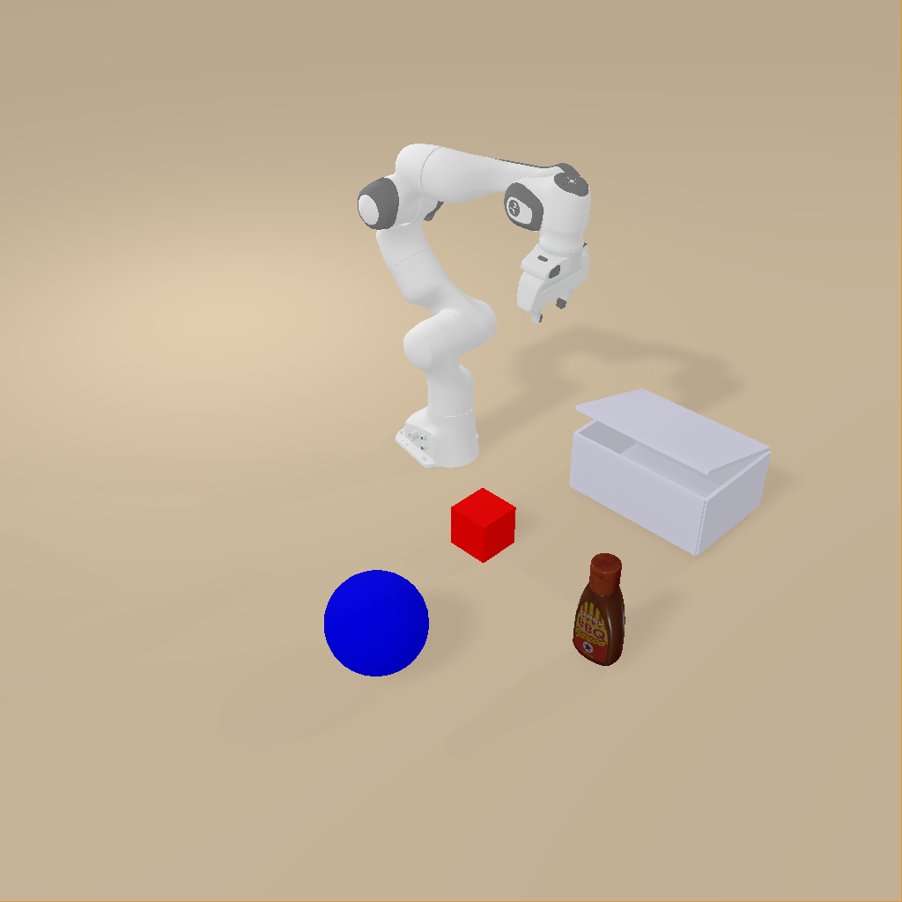
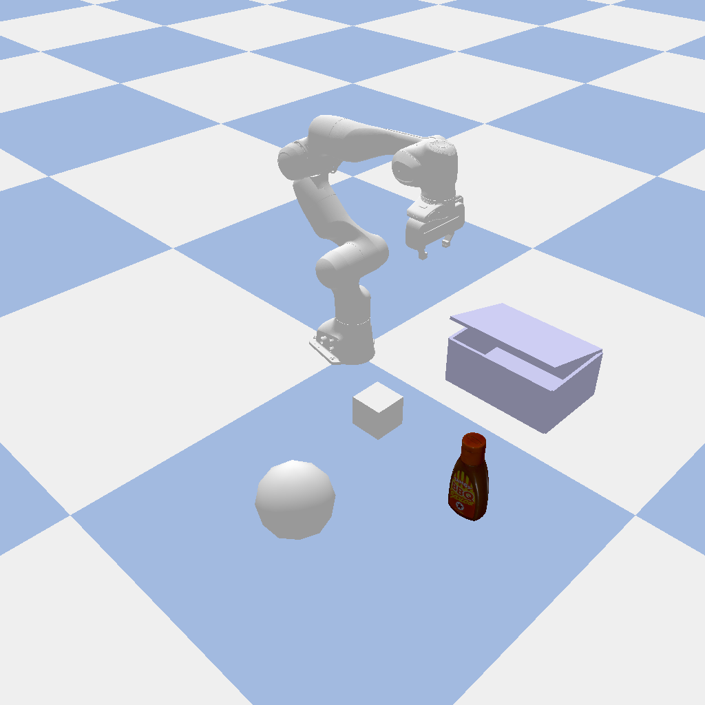

# 0. Static Scene
In this tutorial, we will show you how to use MetaSim to simulate a static scene.

## Common Usage

```bash
python get_started/0_static_scene.py  --sim <simulator>
```
you can also render in the headless mode by adding `--headless` flag. By using this, there will be no window popping up and the rendering will also be faster.

### Examples

#### Isaac Lab
```bash
python get_started/0_static_scene.py  --sim isaaclab
```

#### Isaac Gym
```bash
python get_started/0_static_scene.py  --sim isaacgym
```

#### Mujoco
```bash
python get_started/0_static_scene.py  --sim mujoco --headless
```
Note that we find the `non-headless` mode of Mujoco is not stable. So we recommend using the `headless` mode.

#### Genesis
```bash
python get_started/0_static_scene.py  --sim genesis
```
Note that we find the `headless` mode of Genesis is not stable. So we recommend using the `non-headless` mode.

#### Sapien
```bash
python get_started/0_static_scene.py  --sim sapien3
```

#### Pybullet
```bash
python get_started/0_static_scene.py  --sim pybullet
```


You will get the following image:
---
| Isaac Lab | Isaac Gym | Mujoco |
|:---:|:---:|:---:|
|  |  |  |

| Genesis | Sapien | PyBullet |
|:---:|:---:|:---:|
|  |  |  |
