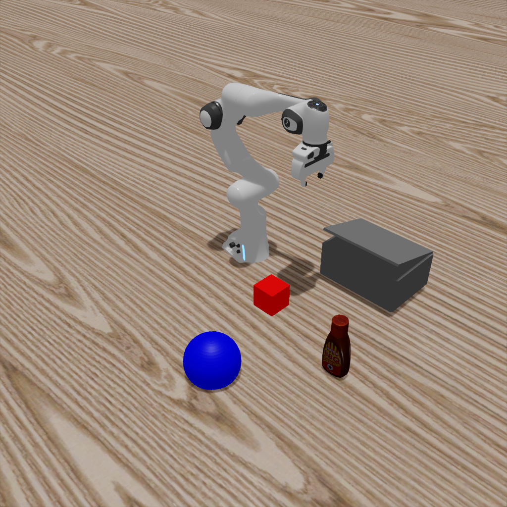
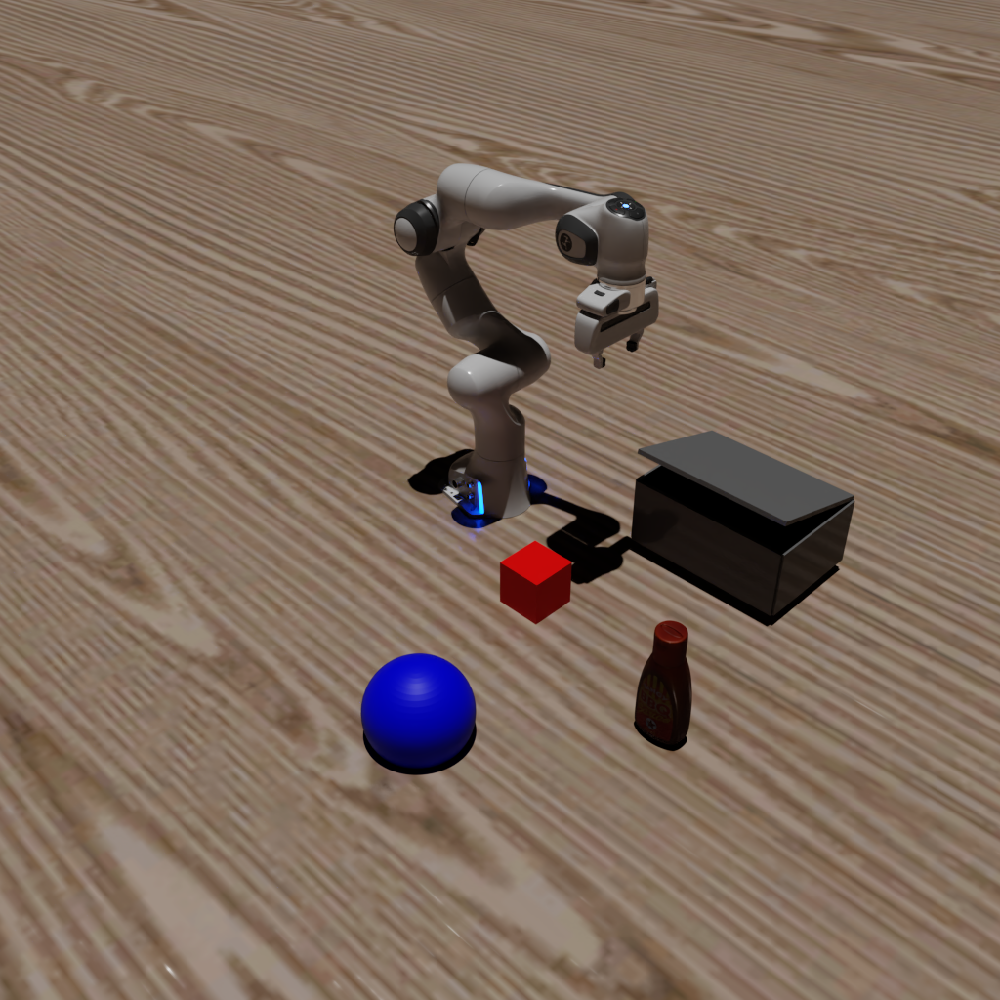

# 6. Advanced Rendering
In this tutorial, we will show you how to use MetaSim to render the scene with advanced rendering techniques. We currently support rasterization, ray tracing, and path tracing.

## Common Usage

```bash
python get_started/6_advanced_rendering.py  --render.mode=[rasterization|raytracing|pathtracing]
```
you can also render in the headless mode by adding `--headless` flag. By using this, there will be no window popping up and the rendering will also be faster.

By running the above command, you will simulate a hybrid system and it will automatically record a video. Here we demonstrate how to use one simulator for physics simulation and another simulator for rendering.


### Examples

#### Ray Tracing
```bash
python get_started/6_advanced_rendering.py  --render.mode=raytracing
```

#### Path Tracing
```bash
python get_started/6_advanced_rendering.py  --render.mode=pathtracing
```


You will get the following images:
---
| Ray Tracing | Path Tracing |
|:---:|:---:|
|  |  |
